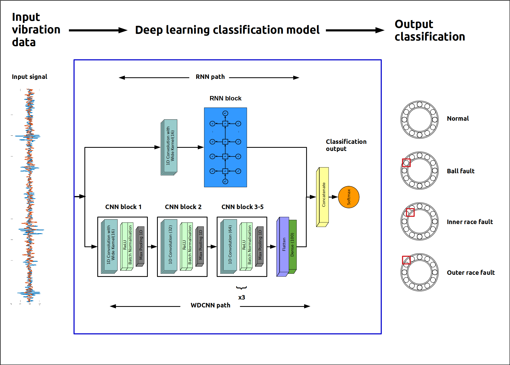

# Rolling Element Bearing Fault Detection Using Deep Learning

This is the repository to go with the paper "[A novel deep learning model for the detection and identification of rolling element bearing faults](https://doi.org/10.3390/s20185112)". It contains all the code to replicate the experiments from the paper and generate the result plots.

## Problem statement

Rolling-element bearings are one of the most common components in industrial machinery. They are used in almost every rotating mechanism (from electric motors to gearboxes to conveyor belt systems) to allow the transmission of power along load bearing axles with a minimum of losses due to friction.

A typical cartridge bearing looks like:


The key elements in rolling-element bearings are:

- Inner Race
- Outer Race
- Rolling Element

According to several studies (e.g. [Thorson and Dalva (1995)](https://ieeexplore.ieee.org/stamp/stamp.jsp?arnumber=464536), [Bonnett and Yung (2008)](https://ieeexplore.ieee.org/abstract/document/4432942), and [IEEE (1985)](https://ieeexplore.ieee.org/document/4158071)) bearing faults are the major cause of failure in electro-mechanical drive systems and motors, causing an estimated 45-70% of all drive and motor failures. These failures are often expensive because of:

- the cost to repair equipment 
- the cost of machinery downtime 
- the cost of any material wastage that is caused by such a failure 

In recent years, the Industry 4.0 paradigm has meant that gathering data from connected sensors has become cheaper and more widespread. Many different machine operating variables can now be monitored remotely in real-time, giving rise to an explosion of available data. However, a key challenge within this Industry 4.0 paradigm is to be able to make intelligent use of the copious amounts of data being generated for applications such as fault diagnosis, remote condition monitoring, and preventative maintenance.

## Methodology

In this work we propose a deep learning based intelligent fault diagnosis system capable of operating on raw vibration signals (with limited data preprocessing). Our approach combines the best of recurrent neural network models with a deep convolutional pathway to achieve better than state-of-the-art results for several common domain adaptation tasks on the benchmark bearing fault data set from Case Western Reserve University (available [here](https://csegroups.case.edu/bearingdatacenter/pages/apparatus-procedures)).

Our proposed system architecture is:



Our results on domain adaptation are:


and our results for noise rejection are:


## To do:

I've not yet finished updating this repository with _all_ the code to replicate the experiments. Stuff that's currently missing / on my todo list is:

- Tidy up and upload CLR callbacks
- Upload trained weights
- Upload code for results processing

## Citation 

If you find this paper and repository helpful please cite:

Shenfield, A.; Howarth, M. A Novel Deep Learning Model for the Detection and Identification of Rolling Element-Bearing Faults. Sensors 2020, 20, 5112.

```
@article {shenfield_howarth_2020,
author  = "Alex Shenfield and Martin Howarth",
title   = "A novel deep learning model for the detection and identification of rolling element bearing faults",
journal = "Sensors",
volume  = "20",
pages   = "5112",
year    = "2020"
}
```


(c) Dr. Alex Shenfield, 2020
